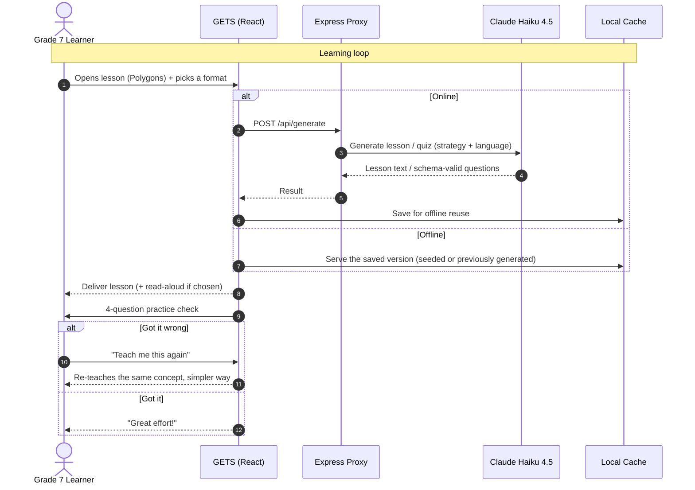

<!-- Date: 25 June 2026 -->

<div align="center">

<!-- TODO: replace with your real logo once you have one -->
<!--  -->

# GETS

**Guided Education for Tailored Success**

*Every learner gets the support they need.*


**Team:** Stack-a-ton
**Hackathon:** ACMTechsprint · June 24–26, 2026
**Live Demo:** `[FILL IN — demo URL / video link]`

</div>

---

## Table of Contents

1. [Overview](#overview)
2. [The Problem](#the-problem)
3. [Why GETS Is Different](#why-gets-is-different)
4. [How It Works](#how-it-works)
5. [Tech Stack](#tech-stack)
6. [Repository Structure](#repository-structure)
7. [Core Features](#core-features)
8. [Screenshots](#screenshots)
9. [Getting Started](#getting-started)
10. [Environment Variables](#environment-variables)
11. [Available Scripts](#available-scripts)
12. [UI/UX Design Direction](#uiux-design-direction)
13. [MVP Scope & Roadmap](#mvp-scope--roadmap)
14. [Team](#team)
15. [Acknowledgements](#acknowledgements)

---

## Overview

GETS is an offline-capable, bilingual (Tagalog + English) AI learning companion for **Grade 7 Filipino students**. It is built on the Department of Education's **MATATAG curriculum** (live for Grade 7 since SY 2024–2025).

Most ed-tech asks *"how do we make this kid learn faster?"* GETS asks *"why did this kid stop trying?"* — because the answer is usually that they were **overwhelmed, not incapable**. GETS teaches a single concept in whichever of five ways actually works for that learner, re-teaches it differently when it doesn't land, and works on a slow or absent connection.

**Primary outcomes:**

- Meet each learner in the format that fits them, not a one-size lesson
- Keep struggling learners engaged instead of left behind
- Run reliably on low-cost devices and patchy connectivity

> **MVP focus:** the build takes one MATATAG competency end-to-end — **Grade 7 Mathematics · Polygons** — through all five teaching formats, in English and Tagalog, online and offline. Subject and topic are isolated in config, so adding more is content work, not re-engineering.

---

## The Problem

The context is urgent and specific:

- The Philippines ranked **near the bottom globally** in the 2018 PISA assessments for reading, maths, and science.
- A 2022 World Bank report found **over 90% of Filipino 10-year-olds** could not read a simple text.
- The **MATATAG curriculum** for Grade 7 went live in **SY 2024–2025** — it is the curriculum these students are on *right now*.
- Connectivity across much of the Philippines is patchy, so an online-only tool doesn't reach the learners who need it most.

GETS is built for exactly this moment, and for the learners traditional classrooms leave behind.

---

## Why GETS Is Different

This is not another offline tutor or quiz app. Three things set it apart.

### 1. One lesson, many ways to learn — and it adapts when you're stuck

A single MATATAG competency is taught five different ways, and when a lesson doesn't land, GETS re-teaches the same concept in a *different* format rather than repeating it louder. **"Explain a different way"** cycles to the next format; **"I don't get it"** drops straight to the simplest (ELI5) explanation; and getting a practice question wrong surfaces **"Teach me this again."** That adapt-on-failure loop is the heart of the product.

### 2. Real AI, designed to survive no signal

The five formats are **generated live by Claude** — they are five prompting strategies over the same competency, not canned text. Every result is cached in the browser the moment it's generated, and a one-command pre-seed step bakes the entire demo into a local file beforehand. So GETS gives you the richness of live generation **and** a build that keeps working when the Wi-Fi drops.

### 3. Filipino-first, accessible by design

Bilingual Tagalog + English throughout — UI *and* lesson content. Read-aloud via the browser's speech engine, short mobile-friendly chunks, and plain-text output with no clutter — designed for low-cost Android phones on low bandwidth.

---

## How It Works



The engine never punishes a wrong answer with a dead end — it routes a failed lesson back to be taught differently, and a cached/seeded copy means a lost connection never blocks the learner.

---

## Tech Stack

> Everything below is what the app **actually runs on** — no aspirational rows.

### Core

| Layer | Technology | Purpose |
| --- | --- | --- |
| Framework | **React 18 + Vite 5** | Mobile-first single-page web app |
| Language | **JavaScript** (JSX, ES modules) | App + server code |
| Styling | **Hand-written CSS** (`src/styles.css`) | Warm, accessible, mobile-first UI |
| Backend | **Express** (local proxy) | Holds the API key; serves `POST /api/generate` so the key never reaches the browser |

### Data & Offline

| Layer | Technology | Purpose |
| --- | --- | --- |
| Local storage | **Browser `localStorage`** (`gets-cache-v1`) | Caches every generated lesson/quiz for instant offline reload |
| Offline seed | **`public/seed-cache.json`** via `npm run seed` | Pre-generates all five formats × EN/TL + a practice set before the demo, so it runs with zero connection |
| Offline detection | `navigator.onLine` + cache fallback | Falls back to the saved version and shows an "offline" badge |

### AI / Content Layer

| Layer | Technology | Purpose |
| --- | --- | --- |
| Generation | **Anthropic API** via `@anthropic-ai/sdk` | Live lesson + practice generation |
| Model | **Claude Haiku 4.5** (`claude-haiku-4-5`; override with `GETS_MODEL`, e.g. `claude-sonnet-4-6`) | Fast and cheap — suited to short bilingual lessons over low bandwidth |
| Structured output | **JSON Schema** (Anthropic structured outputs) | Guarantees parseable, schema-valid 4-choice quizzes |
| Speech | **Browser Web Speech API** (`fil-PH` / `en-US`) | Read-aloud for the "Read & listen" format |

> **Be honest about the AI:** GETS uses **live Claude (Haiku 4.5) generation** for both lessons and quizzes — the five "ways to learn" are five prompting strategies, not hand-written content. To run reliably at a demo and on patchy connections, every result is **cached in the browser**, and `npm run seed` pre-generates the whole demo into `public/seed-cache.json` ahead of time. So: **AI-generated, then cached** — online it generates fresh, offline it serves the saved copy. State it plainly; the cache-for-offline design reads as competence.

---

## Repository Structure

```
gets/
├── index.html                # Vite entry
├── public/
│   └── seed-cache.json        # Pre-generated offline content (created by `npm run seed`)
│
├── shared/
│   ├── generate.mjs           # Anthropic SDK calls — lesson + practice generation
│   └── prompts.mjs            # System prompt, the 5 strategy prompts, practice JSON schema
│
├── server/
│   └── index.mjs              # Express proxy: holds the API key, serves POST /api/generate
│
├── scripts/
│   └── preseed.mjs            # Pre-generates seed-cache.json before the demo
│
├── src/
│   ├── main.jsx               # React entry
│   ├── App.jsx                # Lesson view, 5 strategy pills, EN/TL, adapt-on-failure
│   ├── components/
│   │   └── Practice.jsx       # 4-question quiz; wrong answer → re-teach simpler
│   ├── lib/
│   │   ├── api.js             # Calls /api/generate; falls back to cache when offline
│   │   └── cache.js           # localStorage cache + seed loader
│   ├── strings.js             # Subject/topic config + EN/TL UI copy
│   └── styles.css             # All styling
│
├── .env.example
├── vite.config.js             # Dev proxy: /api → :8787
└── package.json
```

---

## Core Features

### Adaptive multi-format lessons

- **Five live-generated ways to teach one concept:** Read & listen (text + browser voice), Worked example (scaffolding fades), Guiding questions (Socratic), Quest mode (gamified), and Super simple (ELI5, plain Tagalog/English)
- **"Explain a different way"** cycles to the next format; **"I don't get it"** jumps straight to the simplest explanation
- **Adapt-on-failure:** a wrong practice answer surfaces **"Teach me this again"**, which re-teaches the concept a simpler way
- Scoped end-to-end to one MATATAG competency — **Grade 7 Math · Polygons** — with subject/topic isolated in config so new topics are a content change, not code

### Bilingual & accessible

- Full **English / Tagalog** toggle across the UI *and* the generated lessons and quizzes
- **Read-aloud** via the browser speech engine (`fil-PH` / `en-US`)
- Short, mobile-friendly chunks (enforced in the prompt), plain-text output (no markdown clutter), large readable type — friendly to low-literacy and low-bandwidth users
- Mood-sensitive tone (gentler, shorter on a hard day) is wired into the generation layer; the in-app mood check-in is on the roadmap

### Offline-first

- Every generated lesson and quiz is cached in `localStorage` for instant offline reload
- `npm run seed` pre-generates all five formats × both languages + a practice set into `public/seed-cache.json`, loaded on first run, so **the whole demo works with no connection**
- An **"Offline — showing saved lesson"** badge appears when serving cached content

---

## Screenshots

> `[FILL IN — add real screens once the build is camera-ready. Grid below matches what's currently built.]`

| **1. Lesson — Read & listen** | **2. Switch format** |
| --- | --- |
| `[screenshot]` | `[screenshot]` |
| One concept, with read-aloud | "Explain a different way" cycles the five formats |

| **3. Practice** | **4. Offline mode** |
| --- | --- |
| `[screenshot]` | `[screenshot]` |
| 4 questions; wrong → "Teach me this again" | Seeded cache serves lessons with no connection |

---

## Getting Started

### Prerequisites

- **Node.js 18+** and **npm**
- An **Anthropic API key** — get one at [console.anthropic.com](https://console.anthropic.com/settings/keys)

### Installation

```bash
# Clone the repository
git clone [FILL IN — repo URL]
cd gets

# Install dependencies
npm install

# Add your Anthropic API key
cp .env.example .env
# then edit .env and set ANTHROPIC_API_KEY=sk-ant-...

# (Recommended, while online) pre-generate the offline demo cache
npm run seed

# Start the app (React client on :5173 + generation proxy on :8787)
npm run dev
```

Open the printed local URL (default `http://localhost:5173`).

---

## Environment Variables

Create a `.env` file based on `.env.example`:

| Variable | Required | Description |
| --- | --- | --- |
| `ANTHROPIC_API_KEY` | **Yes** | Your Anthropic API key. Used by the proxy and the pre-seed script; never sent to the browser. |
| `GETS_MODEL` | No | Model for generation. Defaults to `claude-haiku-4-5`; set to `claude-sonnet-4-6` for richer output. |
| `PORT` | No | Port for the local generation proxy. Defaults to `8787` (Vite proxies `/api` here). |

---

## Available Scripts

| Command | Description |
| --- | --- |
| `npm run dev` | Run the React client (`:5173`) and the generation proxy (`:8787`) together |
| `npm run dev:client` | Run only the Vite dev server |
| `npm run dev:server` | Run only the Express generation proxy |
| `npm run seed` | Pre-generate `public/seed-cache.json` for offline use (run once, online) |
| `npm run build` | Production build (Vite) |
| `npm run preview` | Preview the production build |

---

## UI/UX Design Direction

### Visual identity

- Warm, friendly, and calm — a supportive companion, never a strict teacher
- Rounded corners, soft colours, generous spacing, large readable text, high contrast
- Bilingual interface mixing Tagalog and English naturally (Taglish)

### Accessibility-first

- Clear hierarchy, no clutter, plain-text lessons (no dense markdown)
- Read-aloud and an EN/TL toggle throughout
- Short, chunked content to reduce cognitive load

### Responsive strategy

- Mobile-first, portrait, optimised for low-cost Android devices and low bandwidth

---

## MVP Scope & Roadmap

### Built in this MVP (for the hackathon)

- **One competency end-to-end** — Grade 7 Math · **Polygons** — through all **five formats**
- **Adapt-on-failure loop**: explain-a-different-way, drop-to-simplest, and re-teach-after-wrong-answer
- **Bilingual EN/TL** UI and generated content, with **read-aloud**
- **4-question practice** with auto-checking and encouraging feedback
- **Offline-first**: browser cache + one-command pre-seed so the demo runs with no connection

### Roadmap (deliberately out of MVP)

- More subjects, topics, and full quarter coverage — *content authoring, not re-engineering*
- Rewards: effort points, forgiving streaks, MATATAG mastery badges
- Parent dashboard (calm weekly summary) and onboarding learning-preference quiz
- In-app mood check-in UI (the generation layer already supports mood-aware tone)
- Named SPED accommodations: OpenDyslexic font, ADHD micro-pacing, autism calm-mode toggles
- Progress sync to a backend when a connection returns

The architecture is **subject-agnostic** — subject/topic live in config (`src/strings.js`, `shared/prompts.mjs`), so every new topic plugs in as content.

---

## Team

**Stack-a-ton**

| Member | Role | LinkedIn |
| --- | --- | --- |
| Ellah Benerado | `[FILL IN]` | `[link]` |
| Eliesha Mae Francisco | `[FILL IN]` | `[link]` |
| Osyris Benedict Fajardo | `[FILL IN]` | `[link]` |
| Lance Miguel Evangelista | `[FILL IN]` | `[link]` |

---

## Acknowledgements

- Curriculum alignment based on the DepEd **MATATAG Curriculum** (Grade 7, SY 2024–2025), Department of Education, Philippines.
- AI generation powered by **Anthropic's Claude** (`@anthropic-ai/sdk`).
- Built with **React**, **Vite**, and **Express**.

---

<div align="center">

*Built with care for the learners traditional classrooms leave behind.*

</div>
