<!-- Date: 26 June 2026 -->

<div align="center">

# GETS

**Guided Education for Tailored Success**

*Every learner gets the support they need.*


**Team:** Stack-a-ton
**Hackathon:** ACM TechSprint × Accenture · June 2026
**Live Demo:** https://gets-app.vercel.app

</div>

---

## Table of Contents

1. [Overview](#overview)
2. [The Problem](#the-problem)
3. [Why GETS Is Different](#why-gets-is-different)
4. [Early Validation](#early-validation)
5. [How It Works](#how-it-works)
6. [How It's AI-Powered](#how-its-ai-powered)
7. [Can Students Trust the AI?](#can-students-trust-the-ai)
8. [Case Study: Grade 7 Mathematics Under MATATAG](#case-study-grade-7-mathematics-under-matatag)
9. [Core Features](#core-features)
10. [Tech Stack](#tech-stack)
11. [Repository Structure](#repository-structure)
12. [Screenshots](#screenshots)
13. [Getting Started](#getting-started)
14. [Environment Variables](#environment-variables)
15. [UI/UX Design Direction](#uiux-design-direction)
16. [Pilot Study Design](#pilot-study-design)
17. [Roadmap](#roadmap)
18. [Go-to-Market & Adoption](#go-to-market--adoption)
19. [Business Model & Financials](#business-model--financials)
20. [The Opportunity](#the-opportunity)
21. [Team](#team)
22. [Acknowledgements](#acknowledgements)

---

## Overview

GETS is an AI-powered, **multilingual (mother-tongue-first)**, offline-capable learning companion for **Filipino learners across the education journey — preschool to college** — including learners with dyslexia, ADHD, and autism. It meets each learner in the way that fits them, in the language they think in, at any stage.

> **Vision vs. MVP — read this first.** GETS is designed to be **grade-agnostic**: the same engine, teaching strategies, and adaptation logic work at any level, with only the curriculum content changing per stage. For this hackathon, our **MVP proves the concept on one concrete, live cohort — Grade 7 Mathematics (polygons)** — chosen because Grade 7 is part of the first MATATAG rollout (SY 2024–2025). The breadth is the vision; the Grade 7 build is the proof it's real.

Most ed-tech asks *"how do we make this kid learn faster?"* GETS asks *"why did this kid stop trying?"* — because the answer is usually that they were **overwhelmed, not incapable**. When a learner gets something wrong, GETS doesn't say *"Wrong. Try again."* It says *"Let's look at it another way"* — and teaches the same concept in a different way until it lands.

GETS serves three people at once:

- **Learners** get a patient tutor that meets them in the format that fits them.
- **Teachers** get a co-pilot that generates lessons, practice, and progress summaries — which they review and approve.
- **Parents** get a clear, jargon-free window into what their child is learning and where they're stuck.

---

## The Problem

Many Grade 7 students enter junior high school with uneven foundations in reading, numeracy, and confidence. In a typical classroom, one teacher supports many learners at very different levels at once:

- Some students understand the lesson immediately; some need a worked example.
- Some are too shy to ask questions.
- Some need the lesson explained in Tagalog or Taglish.
- Some lose access when the internet is slow or unavailable.
- Overcrowded classrooms and high teacher-to-student ratios leave little room for one-on-one attention.
- Parents often don't know exactly which topic their child is struggling with.

The context is urgent and specific:

- The Philippines ranked **near the bottom globally** in the 2018 PISA assessments for reading, maths, and science.
- A 2022 World Bank report found **over 90% of Filipino 10-year-olds** could not read a simple text.
- The **MATATAG curriculum** for Grade 7 went live in **SY 2024–2025** — it is the curriculum these students are on *right now*.
- Connectivity across much of the Philippines is patchy, so an online-only tool doesn't reach the learners who need it most.

The mismatch is structural, not personal — it isn't the student who is failing, but a rigid "one-size-fits-all" system that can't see each learner individually. And the deeper problem is not only access to lessons: it is that **many students stop trying when they feel left behind.** GETS is designed to intervene at exactly that moment.

---

## Why GETS Is Different

This is not another offline tutor or quiz app. Four things set it apart.

### 1. One concept, many ways to learn — and it adapts when you're stuck

A single MATATAG competency can be taught five different ways, and when a lesson doesn't land, GETS re-teaches the same concept in a *different* way rather than repeating it louder. That adapt-on-failure loop is the heart of the product.

### 2. SPED accessibility as a first-class feature

Most teams won't touch accessibility. GETS builds in support for dyslexia, ADHD, and autism as switchable accommodations — *supports, not labels* — so the learners traditional classrooms most often leave behind are the ones it serves best.

### 3. Mother-tongue-first, offline-first

The Philippines has over 120 distinct languages — not dialects — and "Tagalog + English" quietly assumes every learner is fluent in Tagalog, which isn't true: for a child in Cebu, Iloilo, or the Ilocos, Tagalog is often itself a second language. GETS teaches in the learner's **mother tongue**, not just the national one, aligning with MATATAG's own mother-tongue-based multilingual education principle. The MVP ships **six Philippine languages — Tagalog, English, Bisaya, Hiligaynon, Ilocano, and Bikol**; the architecture treats language as a parameter, so more plug in as we validate generation quality in each (see roadmap). All of it works offline on low-cost devices, syncing when a connection returns. *This is how GETS reaches the provincial learners that Tagalog-centric and online-only tools leave behind.*

### 4. Grade-agnostic by design

The engine, teaching strategies, and adaptation logic are built **once** and work at any level — preschool to college. Only the curriculum content changes per stage. Grade 7 is where we prove it; the same architecture extends across the whole education journey without re-engineering.

### At a glance — vs. traditional ed-tech

| | Traditional ed-tech | **GETS** |
| --- | --- | --- |
| **Approach** | One-size-fits-all | **Adaptive** — re-teaches a different way when a lesson doesn't land |
| **Connectivity** | Assumes the internet | **Offline-first** — cached lessons work with no signal |
| **Inclusivity** | SPED treated as a separate track | **Inclusive by default** — dyslexia/ADHD/autism supports for everyone |
| **Language** | Tagalog + English | **Mother-tongue-first** — the language the learner thinks in |

---

## Early Validation

GETS is early-stage, and we're honest about that — no signed pilot yet, no validated pricing (those are explicit next-step priorities). But the prototype has been put in front of a **deliberately diverse group of testers** — practising teachers, psychology students, parents, learners, and industry professionals — and the direction held up across all of them:

- **Learners** — the prototype was tested hands-on with **Grade 9 students of Section 9-Kudarat at Fortunato F. Halili National Agricultural School (FFNAS)**, who reported **higher engagement and less frustration**; parents noted GETS channels kids' pull toward screens into productive learning rather than passive gaming.
- **Educators** — a practising private high-school teacher said she **would use it in her own classroom**, and testers found the **class dashboard** a real cut in administrative load — the strongest signal we can get, since teachers are the gatekeepers to adoption.
- **Psychology & pedagogy** — psychology students reviewed the inclusive, UDL-based design and confirmed it **lowers the barrier for neurodivergent learners**.
- **Industry & mentorship** — a professional from Accenture gave **positive feedback on the concept**, and business professionals and parents helped pressure-test the roadmap for scalability and real-world home use.

> *These are early, informal signals — directional encouragement and user feedback, not formal endorsements or partnerships. In this section we describe the feedback by role rather than attributing specific claims to named people; the testers who consented are thanked by name in the [Acknowledgements](#acknowledgements). Our near-term priority is to turn this interest into a **structured pilot with documented outcomes**.*

---

## How It Works

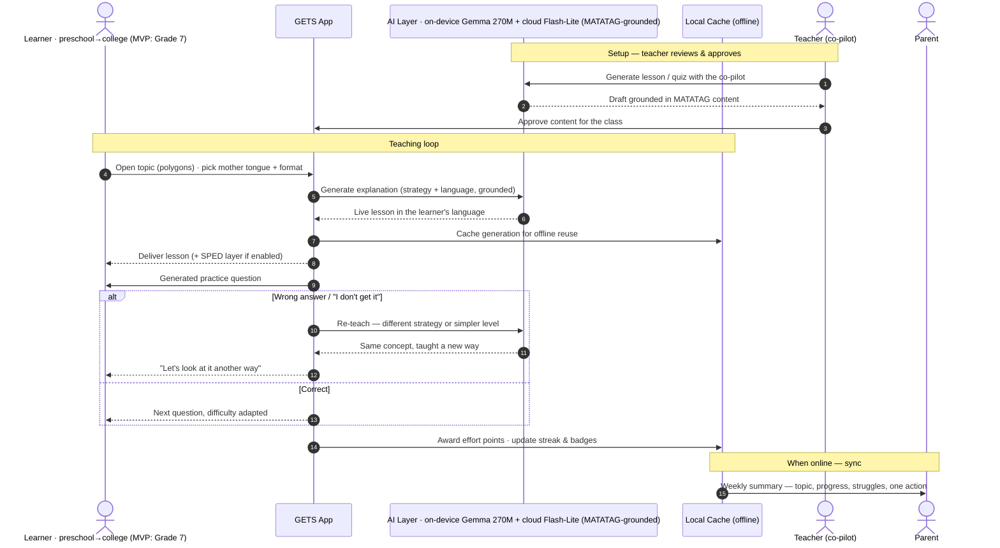

The engine never punishes a wrong answer with a dead end — it routes a failed lesson back to be taught differently, in the learner's own language, and remembers which approach worked so the next lesson starts smarter. The teacher stays in the loop as reviewer; the parent gets a calm weekly window when a connection returns.

---

## How It's AI-Powered

GETS generates every lesson and practice set **live** — it is not a library of pre-written content. Generation runs on a **hybrid engine**: an **on-device model (Gemma 3 270M)** generates **offline by default**, and **Gemini 2.5 Flash-Lite (cloud)** adds higher-fidelity content seeding and live personalisation when a connection is available.

- **Explaining concepts in the learner's language:** the AI generates each explanation on demand, in the chosen language — **six Philippine languages in the MVP (Tagalog, English, Bisaya, Hiligaynon, Ilocano, Bikol)**, with more added as generation quality is validated — using one of **five teaching strategies**, which are five different ways of *prompting* the model:
  1. **Read and listen** — a clear written explanation, with read-aloud
  2. **Worked example** — solve one fully, then a similar one with steps to complete
  3. **Guiding questions** — Socratic teaching, learning by being asked
  4. **Quest mode** — the concept framed as a short challenge
  5. **Super simple explanation** — plain-language ELI5, in Tagalog or Taglish
- **Generating practice:** the AI produces fresh practice questions on the fly, scaled to the topic — not a fixed question bank.
- **Adapting to level:** the AI evaluates answers, explains *why* a mistake is wrong, and regenerates the concept at a simpler level or in a different strategy.

**Offline by default:** because the on-device model (Gemma 3 270M) runs locally, a learner generates and keeps working lessons and practice **with no connection at all** — the cloud layer (Gemini 2.5 Flash-Lite) is an *enhancement, not a requirement*. Generations are cached, and richer cloud content syncs down when online. Because the output is concise text, it's also light over slow connections.

---

## Can Students Trust the AI?

An AI tutor that confidently teaches something wrong is worse than no tutor. GETS earns trust by design:

- **Grounded in the curriculum, not freelancing.** Generation is anchored to the actual DepEd MATATAG competency and content, so the AI explains *verified material* rather than guessing from open-ended prompts.
- **Teacher-reviewed.** The teacher reviews and approves AI-generated lessons, quizzes, and summaries before they reach students. The AI assists; the teacher remains the authority.
- **Source-tagged.** Lessons show they're drawn from the student's real Grade 7 MATATAG syllabus, so learners and parents can see it's their actual curriculum.
- **Designed to defer.** When the AI is unsure, it points the student back to their teacher or textbook rather than inventing an answer.
- **Privacy-first.** Student data is minimised and anonymised, and handled in line with the **Data Privacy Act of 2012 (RA 10173)** — accounts are local-first by default, so a learner can use GETS without their data leaving the device.

GETS is a **companion, not a replacement** for the teacher — the principle throughout is simple: **the AI suggests, the teacher decides.**

---

## Case Study: Grade 7 Mathematics Under MATATAG

> *This is the **MVP proving ground** — one concrete stage chosen to demonstrate an approach designed for the whole education journey. The scenarios below are Grade 7, but the loop they illustrate (teach → check → re-teach differently → adapt) is the same at any level.*

A Grade 7 public-school learner is studying **polygons** — a topic that needs both language comprehension and spatial reasoning, where uneven foundations show up quickly.

### Learner scenario

The teacher explains polygons in class, but the learner doesn't fully grasp the difference between sides, vertices, angles, and types of polygons.

At home, the learner opens GETS on a mobile phone. GETS explains the concept in simple language. When the learner still doesn't understand, GETS **changes the teaching format** rather than repeating itself — the learner can switch between read-and-listen, a worked example, guiding questions, quest mode, or a super-simple explanation, in Tagalog or English.

When the learner answers a practice question incorrectly, GETS responds with **encouragement**, explains the mistake, and re-teaches the concept more simply. The learner keeps going even when the connection drops, because lessons and practice are cached offline. Accessibility supports (dyslexia-friendly font and read-aloud, shorter ADHD-friendly chunks, a calm low-clutter mode) can be switched on at any time.

### Teacher scenario

The Grade 7 Mathematics teacher uses GETS as a **co-pilot** to generate a short lesson plan on polygons, practice questions, a quiz with answer key, simpler explanations for struggling learners, enrichment for advanced learners, and a parent-friendly progress summary. **The teacher reviews and approves all AI-generated content.** GETS doesn't replace the teacher — it helps the teacher personalise support for more students at once.

### Parent scenario

The parent opens a simple dashboard and sees more than a grade: which topic the child practised, which questions they got right, which concepts were difficult, how many times they asked for re-teaching, and suggested home practice for the week.

> *Example summary:* Your child understands basic polygon names but needs more practice identifying sides, vertices, and angles. Try 10 minutes of practice this week using objects at home — windows, notebooks, and tiles.

The parent doesn't need to be a maths expert. GETS gives simple, supportive guidance.

### Why this case matters

The deeper problem isn't access to lessons — it's that students stop trying when they feel left behind. Instead of *"Wrong. Try again,"* GETS says *"Let's look at it another way."* That single shift — from speed to dignity — is what makes GETS useful to learners, teachers, and parents in real Philippine classroom conditions.

---

## Core Features

GETS rests on **five pillars**:

| Pillar | What it delivers |
| --- | --- |
| **Adaptive learning** | Non-linear teaching — one concept through multiple formats, re-taught a different way when it doesn't land |
| **Inclusivity** | First-class support for neurodivergent learners (ADHD, dyslexia, autism) and instruction in the learner's mother tongue |
| **Teacher empowerment** | AI-drafted lesson plans and quizzes plus real-time class dashboards that cut administrative load |
| **Parental engagement** | Transparent progress tracking, AI-curated home study tips, and a direct line to the teacher |
| **Accessibility** | Offline-first architecture so learners in remote, low-connectivity areas aren't left out |

### Adaptive multi-format lessons (AI-generated)

- Five teaching strategies generated live, in the learner's mother tongue
- An **"explain again a different way"** action and automatic **re-teaching** when a lesson doesn't land
- Mapped to **MATATAG Grade 7 competencies** (Quarter 1: polygons, forces & motion, poetry)

### Ask the tutor anything (conversational)

- A **text chat** where the learner can ask the AI tutor questions in their own words — *"bakit po ganito?"*, "can you explain step 2 again?", "give me a harder one" — instead of only following a fixed lesson path
- The conversation stays **grounded in the MATATAG topic** and the tutor's supportive, defer-when-unsure behaviour, so it helps rather than wanders or invents
- Lets a shy learner ask the questions they'd never raise in a class of 40

### SPED accessibility modes

- **Dyslexia** — dyslexia-friendly font, read-aloud, text highlighting while reading
- **ADHD** — micro-lessons (3–5 min), focus-friendly pacing, frequent rewards
- **Autism** — predictable layout, reduced visual clutter, structured flow

### Teacher co-pilot

- Generate lesson plans, practice, quizzes with answer keys, differentiated explanations, and parent summaries — all teacher-reviewed before use

### Reward system (designed not to backfire)

- **Effort points** for showing up and trying — not just correct answers
- **Forgiving streaks** with freezes and a comeback bonus, so a missed day or no signal doesn't punish the learner
- **Mastery badges** tied to real MATATAG competencies (e.g. "Polygon Master · Q1 Math")
- **Optional class leaderboard** ranked on effort and consistency, off by default

### Emotion-aware learning

- A gentle, optional mood check-in that adjusts lesson tone — shorter, gentler, more encouraging on a hard day

### Parent dashboard

- A calm weekly summary, **not a gradebook**: what was practised, what's difficult, how often re-teaching was needed, and one concrete suggestion to help at home

### Offline-first

- **On-device generation (Gemma 3 270M)** works with no connection at all; progress logs locally and richer cloud content syncs when online

---

## Tech Stack

> This table reflects what the app **actually runs on** in the MVP.

### Core

| Layer | Technology | Purpose |
| --- | --- | --- |
| Framework | **React 18 + Vite 6 + TypeScript** | Mobile-first single-page web app |
| Styling | **Tailwind CSS v4** + shadcn/ui | Warm, accessible, mobile-first UI |
| Auth | **Local-first accounts** (`localStorage`) | Sign-up / log-in for student, parent, teacher — no backend required |
| Backend | **Vercel serverless functions** (`api/*.js`) | Hold the API key; proxy generation + TTS so the key never reaches the browser |
| Hosting | **Vercel** | Deployed at gets-app.vercel.app |

### AI / Generation

| Layer | Technology | Purpose |
| --- | --- | --- |
| Generation — offline | **Gemma 3 270M** on-device | Offline-default generation — lessons & practice with no connection, ₱0 marginal cost |
| Generation — online | **Google Gemini 2.5 Flash-Lite** (cloud, override with `GEMINI_MODEL`) | Enhancement layer — higher-fidelity content seeding + live personalisation when connected |
| Provider router | `src/ai/` — on-device **Gemma 3 270M** (offline default) → **Gemini 2.5 Flash-Lite** (cloud enhancement) → **mock** fallback | One swappable seam across the hybrid |
| Voice | **Gemini TTS** (`api/tts.js`) with Web-Speech fallback, plus **speech-to-text** (Web Speech API) | Two-way voice tutor — talk to it, it talks back |
| Prompting | Five teaching strategies + per-language system prompts | How the model is instructed to teach |
| Grounding | MATATAG curriculum content | Anchors generation to verified material |

### Accessibility & Offline

| Layer | Technology | Purpose |
| --- | --- | --- |
| SPED settings | Global a11y context — dyslexia font, large text, calm mode, read-aloud, bionic reading, zen, focus micro-lessons, and Dyslexia/ADHD/Autism profiles | Switchable accommodations applied app-wide |
| Languages | Tagalog · English · Bisaya · Hiligaynon · Ilocano · Bikol | Mother-tongue-first |
| Offline | **On-device Gemma 3 270M generation** + local accounts + cached TTS + PWA precache | Full lesson delivery runs with no connection; the cloud layer only enhances |

> **The hybrid in one line:** full lesson delivery runs **offline on-device (Gemma 3 270M)**; **Gemini 2.5 Flash-Lite** is an online enhancement layer (content seeding + live personalisation), never a dependency.

---

## Repository Structure

```
stack-a-ton/
├── api/
│   ├── generate.js          # serverless: POST /api/generate → Gemini 2.5 Flash-Lite (cloud)
│   └── tts.js               # serverless: POST /api/tts → Gemini TTS (audio)
├── server/
│   ├── gemini.mjs           # Gemini chat call (key from env)
│   └── gemini-tts.mjs       # Gemini TTS call → WAV
├── src/
│   ├── app/App.tsx          # all screens: auth, onboarding, student/parent/teacher
│   ├── ai/                  # provider router (Gemma on-device / Flash-Lite cloud / mock), useAI, TTS controller
│   ├── auth/store.ts        # local-first accounts + session
│   ├── components/ui/       # shadcn/ui primitives
│   ├── imports/             # mascot art + image assets
│   └── styles/              # Tailwind theme + fonts
├── public/                  # favicon + OG share image
├── vercel.json
├── vite.config.ts
├── package.json
└── README.md
```

---

## Screenshots

> Captured from the live MVP at **[gets-app.vercel.app](https://gets-app.vercel.app)** (mobile-web, student flow).

| **Welcome** | **Create Account (on-device)** | **Mother-Tongue Picker** |
| :---: | :---: | :---: |
| 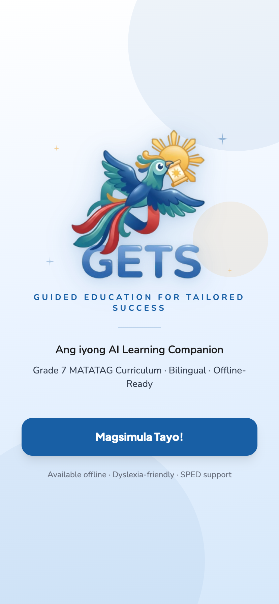 | 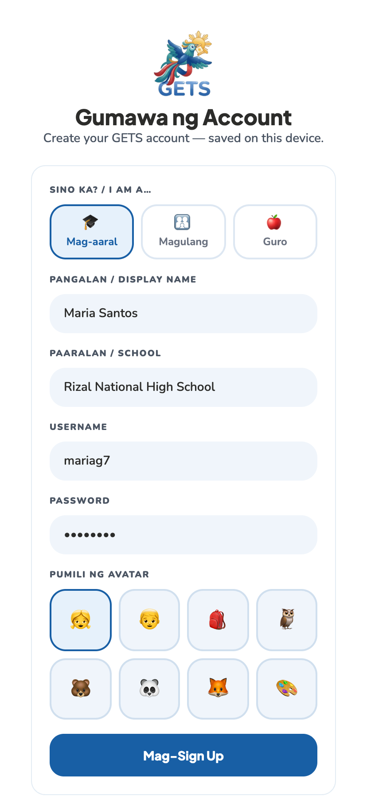 | 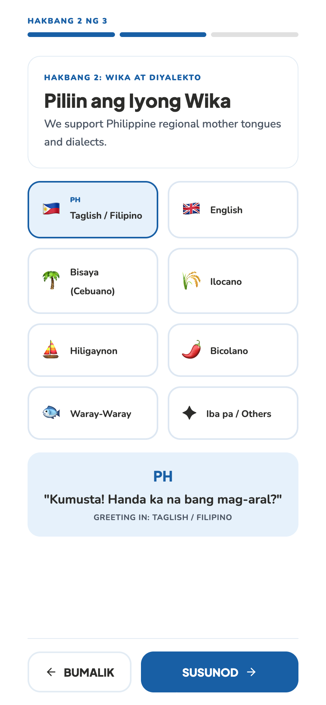 |

| **Learning-Style Assessment** | **Mood / SEL Check-In** | **Home Dashboard** |
| :---: | :---: | :---: |
| 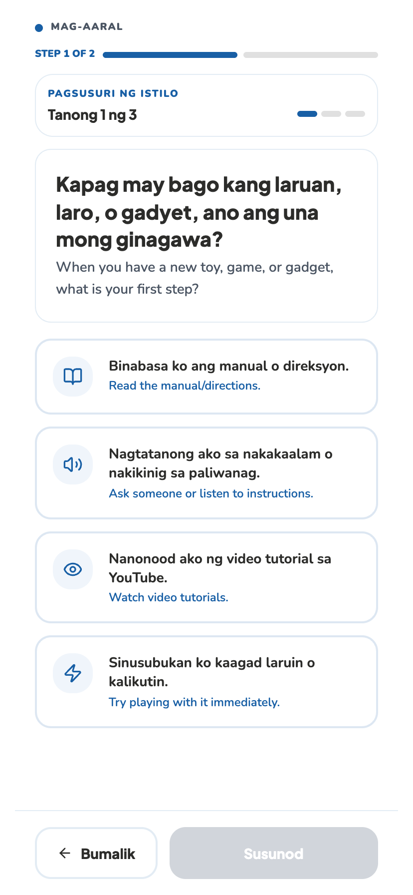 | 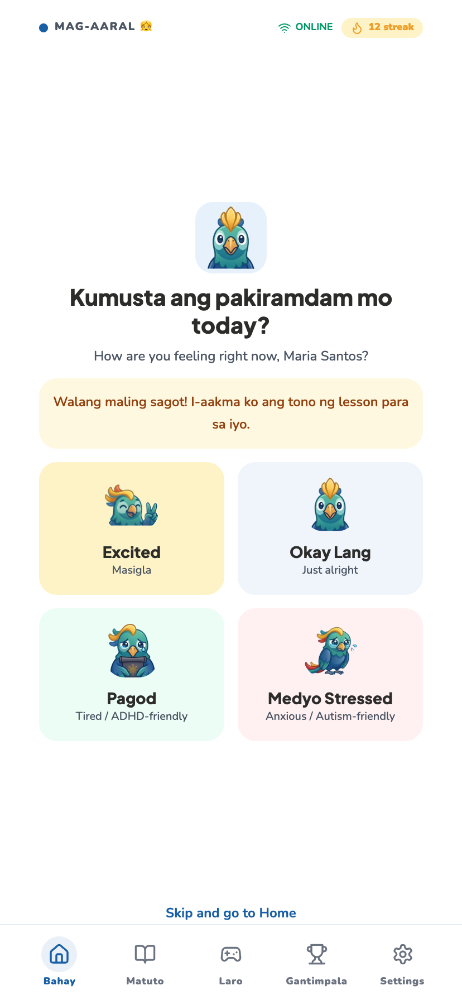 | 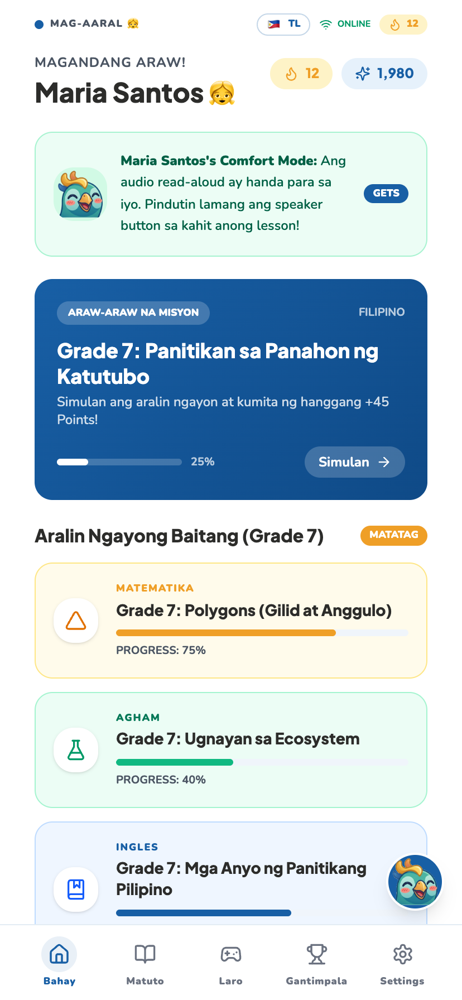 |

| **Multi-Format Lessons** | **Gamified Practice** | **Rewards & Streaks** |
| :---: | :---: | :---: |
| 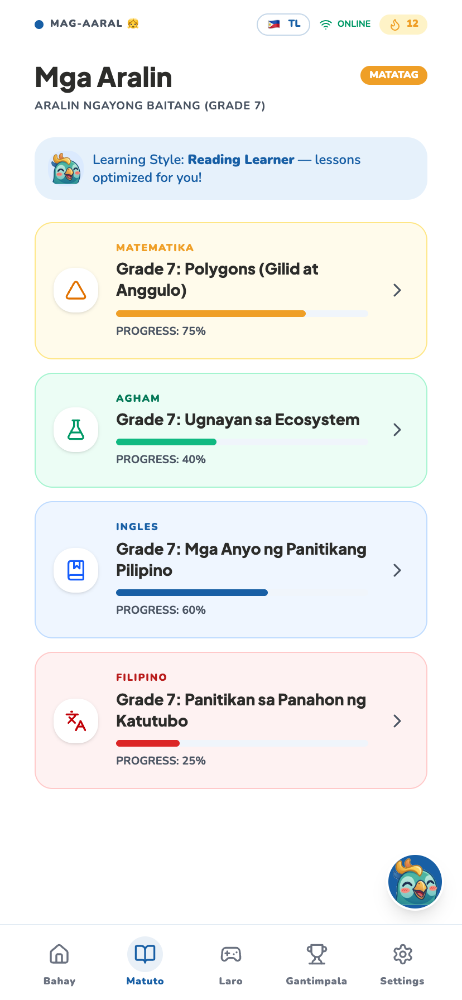 | 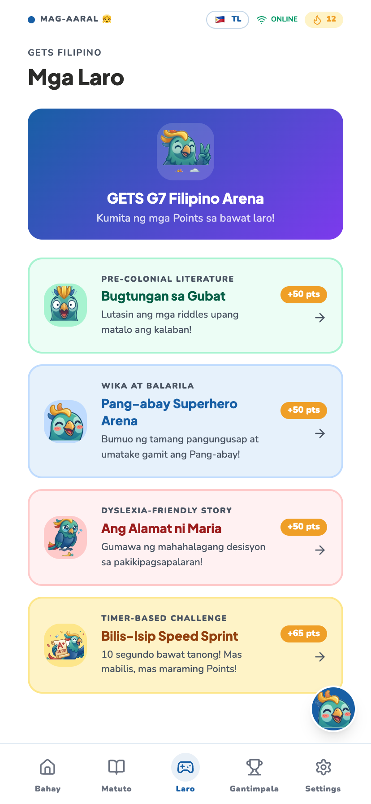 | 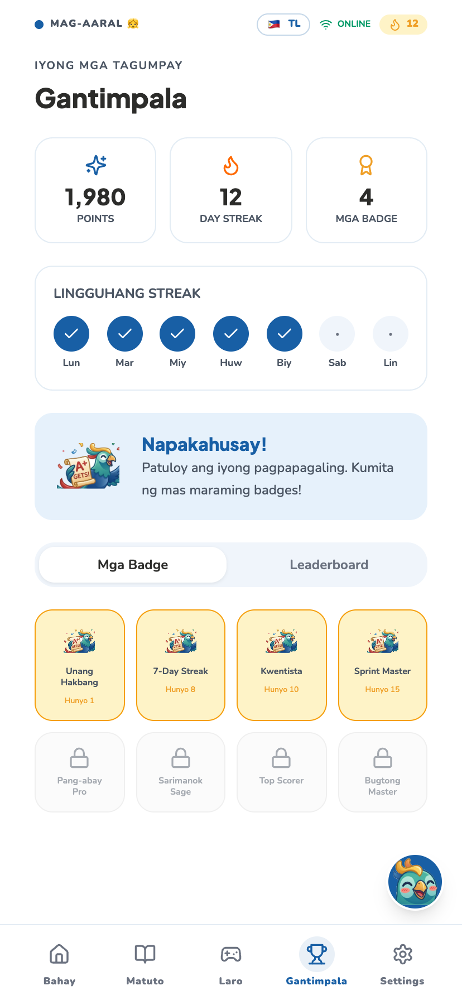 |

| **Accessibility / SPED Settings** | **AI Tutor (offline)** | **Inside a Lesson (Read · Listen · Watch)** |
| :---: | :---: | :---: |
| 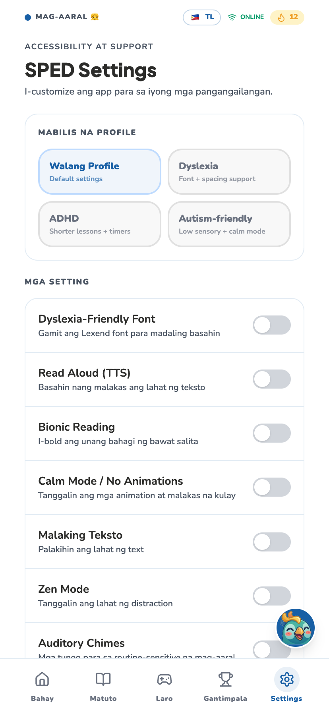 | 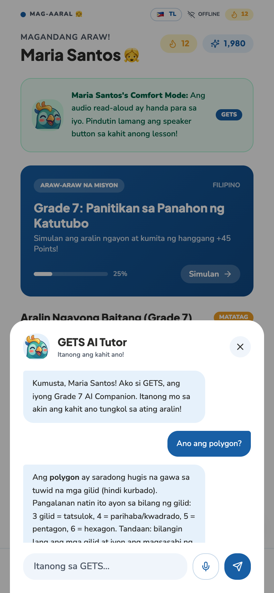 | 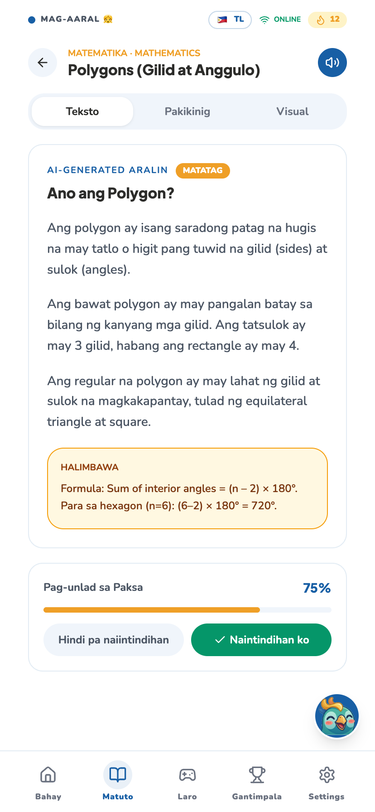 |

---

## Getting Started

### Prerequisites

- **Node.js 18+**
- An API key for the cloud enhancement layer — **Google Gemini 2.5 Flash-Lite** (free tier, no card; key at [aistudio.google.com/apikey](https://aistudio.google.com/apikey)). *Offline on-device generation needs no key.*

### Installation

```bash
git clone https://github.com/realminds-ellah/stack-a-ton.git
cd stack-a-ton
npm install
cp .env.example .env.local    # then add your GEMINI_API_KEY
npm run dev                   # app on http://localhost:5173
```

### Deploy (Vercel)

```bash
npm run build                 # sanity-check the production build
# then: push to GitHub and "Import Project" on vercel.com (auto-detects Vite),
# or use the CLI:  npx vercel --prod
```

Set `GEMINI_API_KEY` (and optionally `GEMINI_MODEL`) as **environment variables** in Vercel — the `api/` folder deploys as serverless functions automatically, and the key stays server-side.

> **Keep your API key out of the repo.** `.env.local` is in `.gitignore` — never commit it.

---

## Environment Variables

| Variable | Required | Description |
| --- | --- | --- |
| `GEMINI_API_KEY` | Yes (for AI) | Google AI Studio key — used by both chat and TTS. Server-side only. |
| `GEMINI_MODEL` | No | Cloud enhancement model, defaults to `gemini-2.5-flash-lite` |
| `GEMINI_TTS_MODEL` | No | Voice model, defaults to `gemini-2.5-flash-preview-tts` |
| `GEMINI_TTS_VOICE` | No | TTS voice, defaults to `Aoede` |
| `VITE_AI_ENDPOINT` | No | Frontend → generation route (default `/api/generate`) |
| `VITE_TTS_ENDPOINT` | No | Frontend → TTS route (default `/api/tts`) |

---

## UI/UX Design Direction

- **Visual identity:** warm, friendly, calm — a supportive companion, never a strict teacher. Rounded corners, soft colours, generous spacing, large readable text, high contrast.
- **Multilingual, mother-tongue-first:** the learner's own language, not just the national one. MVP in Tagalog + English (mixing naturally as Taglish); other Philippine languages on the roadmap.
- **Accessibility-first:** clear hierarchy, dyslexia-friendly typography option, read-aloud and text-size controls, a calm reduced-clutter mode.
- **Responsive:** mobile-first, portrait, optimised for low-cost devices and low bandwidth.

---

## Pilot Study Design

A real school pilot can test GETS using one Grade 7 Mathematics topic.

**Setup:** Grade 7 · Mathematics · Polygons · 1–2 weeks · one or two sections · student/school mobile devices · online when available, offline when needed.

**Pre-test:** basic polygon identification; sides, vertices, and angles; confidence rating before using GETS.

**Intervention:** students learn polygons through the five teaching formats, complete practice, and receive re-teaching after wrong answers; teachers monitor class-level progress; parents receive a short summary.

**Post-test:** parallel polygon assessment; confidence rating; teacher and parent feedback; offline-usage check.

**Success indicators:** improvement from pre- to post-test; fewer repeated mistakes; more completed practice attempts; increased confidence; teacher-reported time saved; parent understanding of weak areas.

> *Targets are illustrative until the pilot runs — frame any figures as goals, not results.*

---

## Roadmap

GETS is **grade-agnostic by design**. The MVP proves the engine on Grade 7; every stage beyond it is content authoring on a fixed architecture — not a rebuild.

### Now — MVP (hackathon build)

- Grade 7 **Mathematics, Science, English** (MATATAG, SY 2024–2025)
- **Polygons** competency end-to-end: five AI-generated teaching formats, SPED modes, offline cache
- **Gemma 3 270M (on-device)** as the offline-default generation model, with **Gemini 2.5 Flash-Lite (cloud)** as a connected-mode enhancement layer for higher-fidelity content seeding and live personalisation
- **Teacher co-pilot**, **parent dashboard**, forgiving streak & effort rewards
- Six languages: **Tagalog, English, Bisaya, Hiligaynon, Ilocano, Bikol**

### Near term — pilot & validate (Months 1–6)

- Structured pilot with a private school or NGO partner; documented **pre/post learning outcomes**
- Validate pricing with the first paying school
- Validate the hybrid-generation cost assumptions (below) against real usage telemetry — including the **Flash-Lite quality trade-off** for SPED variants and live personalisation
- Expand to remaining Grade 7 quarters and subjects

### Medium term — grade expansion (Year 1–2)

- **Grade 8 and Grade 10** (next MATATAG phased-rollout cohorts)
- Elementary-school entry
- A **light teacher dashboard** for class-level deployment (without becoming a heavy LMS)

### Long term — full journey & language expansion (Year 2+)

- **Preschool through college** — riding the MATATAG phased rollout (grade by grade through 2027–2028)
- Further **mother-tongue expansion** by reach (2020 Census home-language data) — adding **Waray** and beyond, each only once generation quality is validated in it
- Continued **on-device generation** as device capability allows, with Gemini 2.5 Flash-Lite (or successor cloud models) remaining the connected enhancement layer
- **DepEd / LGU procurement track**, backed by Phase 1–2 pilot evidence

The architecture is **grade- and subject-agnostic** — the engine, prompts, rewards, and accessibility layers are built once, and every new stage or subject plugs in as content.

---

## Go-to-Market & Adoption

GETS wins **one beachhead first**, proves outcomes, then expands. Chasing every payer at once is how ed-tech ventures stall.

- **Phase 1 — Private Schools & NGO Learning Centres.** These move fastest: they have technology budgets, feel the SPED-and-personalisation gap most acutely, and decide without multi-year procurement cycles. A paying private school **underwrites free access for public-school learners — cross-subsidy by design.** Government innovation and digital-development programmes (e.g. **DOST**, **DTI**) and corporate **CSR/foundations** fund public-school pilots directly.
- **Phase 2 — DepEd / LGU Scale.** The truest mission fit, but the longest sales cycle — the **long game earned with Phase 1–2 pilot evidence and documented learning outcomes**, not a Year 1 revenue line. GETS is **MATATAG-native** and **offline-capable**, the two preconditions DepEd procurement will require. *(The online enhancement layer (see Cost Structure) is an optional upgrade, not a dependency — full lesson delivery still runs entirely offline, so this precondition holds regardless of connectivity.)*

The gatekeeper to real adoption is the **teacher** — and GETS already has directional validation from a practising private high-school teacher who said she would use it in her own classroom.

### Why this is defensible (the moat)

The AI itself is a commodity — anyone can call a model, and on-device small models are improving fast. GETS's durable advantage is **everything built around the model**, none of which a general chatbot replicates:

- **MATATAG-grounding** — aligned to the actual DepEd curriculum, so it teaches the right thing and doesn't hallucinate generic content
- **Pedagogical design** — five teaching strategies and the adapt-on-failure loop, not just answers
- **SPED depth** — accessibility most tools won't touch
- **Three-user fit** — learner, teacher, and parent, matching how Philippine education actually works
- **Filipino-first localisation** — six mother tongues, offline-capable, built for low-cost devices

---

## Business Model & Financials

**Core principle: GETS will never charge the learners it exists to serve. Someone else pays.**

### Who pays

| Payer | Notes (annual renewal) |
| --- | --- |
| Private schools | Scales with enrolment |
| CSR / foundations | Funds public-school pilots |
| NGO learning centres | Case-by-case |
| Public schools | Funded via cross-subsidy and grants |

### Subscription tiers

| Tier | Annual revenue (₱) | Students | Parents | Teachers | Total savings (₱) |
| --- | --- | --- | --- | --- | --- |
| **Small** | 90,000 | 300 | 600 | 40 | 0 (baseline) |
| **Medium** | 170,000 | 600 | 1,200 | 80 | 10,000 |
| **Large** | 300,000 | 1,100 | 2,200 | 120 | 30,000 |

### Pricing model & cost structure

**Pilot pricing: ₱300 per student per year** — all-in for the student + linked parents (2 per student) + proportional teacher access. Not a per-school flat licence at this stage. *(For the post-pilot DepEd/private-school phase, a flat-licence table can sit alongside this — ask and we'll keep both.)*

**Pilot cohort:** 300 students · 600 parents (300 child-summaries) · 40 teachers.

**Cost structure — hybrid generation architecture.** **Gemma 3 270M** handles offline generation at **₱0 marginal cost**; **Gemini 2.5 Flash-Lite** handles the paid online layer (content seeding + live personalisation that can't be pre-cached). Cloud pricing: **$0.10 / 1M input tokens, $0.40 / 1M output tokens** (Google's published rate, June 2026). Exchange rate: **₱61 ≈ US$1**.

**Annualised call volumes** (10-month active school year; 2 months summer = zero AI usage):

| Role | Calls/year | Basis |
| --- | --- | --- |
| Student | 2,000 | High-engagement online usage: hints, ask-tutor chat, practice regeneration |
| Teacher | 3,000 | Heaviest user — lesson-plan co-pilot, quiz generation, differentiated explanations, class reports |
| Parent (per child) | 250 | Weekly progress summary + occasional "explain this to me" |

**1. One-time — seeding the cached content library** (cost is per piece of content, not per student):

| Item | Estimate |
| --- | --- |
| Grade 7 competencies (Math, Science, English) | ~120 |
| Teaching formats per competency | 5 |
| SPED variants per format | 3 |
| **Total seed generation calls** | **1,800** |
| **Total one-time cost** | **≈ $0.86 (≈ ₱53)** |

**2. Recurring — AI inference, per unit per year:**

| Role | Calls/year | Cost/call | Cost/year (1 unit) |
| --- | --- | --- | --- |
| Student | 2,000 | $0.00019 | $0.38 (₱23.18) |
| Teacher | 3,000 | $0.00048 | $1.44 (₱87.84) |
| Parent (per child) | 250 | $0.00016 | $0.04 (₱2.39) |

**3. Cohort-level AI bill** (300 students · 40 teachers · 300 child-summaries):

| Group | Annual AI cost |
| --- | --- |
| Students (300) | $114.00 (₱6,954) |
| Teachers (40) | $57.60 (₱3,514) |
| Parents (300 summaries) | $11.78 (₱718) |
| **Total AI inference** | **$183.38 (≈ ₱11,186)** |

**Cloud infrastructure (annual, full stack — not just AI):**

| Item | Annual cost |
| --- | --- |
| Supabase Pro (DB, auth, storage, realtime) | ₱18,300 |
| Vercel Pro (hosting, 1 seat, functions, bandwidth) | ₱14,640 |
| Push notifications (Firebase Cloud Messaging) | ₱0 (free tier) |
| Domain | ₱732 |
| Monitoring / error tracking | ₱0 (free tier) |
| **Total infrastructure** | **₱33,672** |

At **940 total accounts** (300 + 600 + 40), this stays comfortably inside Supabase/Vercel Pro limits — no overage charges yet.

**Total loaded OpEx (incl. 25% labour overhead):**

| Component | Amount |
| --- | --- |
| AI inference | ₱11,186 |
| Cloud infrastructure | ₱33,672 |
| One-time content seed | ₱53 |
| Subtotal | ₱44,911 |
| Labour overhead (25%) | ₱11,228 |
| **Total loaded OpEx** | **₱56,138** |

**Pricing check:**

| Metric | Value |
| --- | --- |
| Revenue (300 students × ₱300) | ₱90,000 |
| Total loaded OpEx | ₱56,138 |
| **Surplus** | **₱33,862** |
| **Margin** | **37.6%** |
| Break-even price/student (worst case, students carry 100%) | ₱187.13 |

**Per-unit loaded OpEx** (AI cost + fair share of infra/seed/labour):

| Role | AI/year | Shared infra+seed+labour/year | Total loaded OpEx/year |
| --- | --- | --- | --- |
| Student | ₱23 | ₱70 | ₱93 |
| Teacher | ₱88 | ₱70 | ₱158 |
| Parent (per child) | ₱2 | ₱70 | ₱73 |

> **Quality trade-off (still unresolved):** Flash-Lite's quality-vs-cost trade-off against full Flash has **not** been empirically validated against GETS's actual content — especially SPED variants and live personalisation, where output fidelity has real pedagogical stakes. Treat the figures above as **validated math on a cost ceiling, not yet a validated quality decision.**

---

## The Opportunity

We're looking for partners to take GETS from prototype to proof:

- **Pilot partners** — public schools, NGOs, and CSR/grant sponsors to run a structured Grade 7 pilot with documented learning outcomes.
- **Mentorship** — guidance on scaling strategy, ed-tech go-to-market, and DepEd/LGU pathways.

If you want to help build the next generation of inclusive, offline-first Filipino education, **[let's talk](https://www.linkedin.com/in/ellahvate)**.

---

## Team

<div align="center">

**Stack-a-ton**

<table>
  <tr>
    <td align="center" width="25%">
      <br/>
      <strong>Ellah Benerado</strong><br/>
      <sub>Co-Founder · Full-Stack &amp; AI Engineer</sub><br/>
      <br/>
      <a href="https://www.linkedin.com/in/ellahvate"></a>
    </td>
    <td align="center" width="25%">
      <br/>
      <strong>Eliesha Mae Francisco</strong><br/>
      <sub>Co-Founder · UI Design &amp; Learning Experience Developer (LXD)</sub><br/>
      <br/>
      <a href="https://www.linkedin.com/in/elifrncsc"></a>
    </td>
    <td align="center" width="25%">
      <br/>
      <strong>Lance Evangelista</strong><br/>
      <sub>Co-Founder · Business Strategy &amp; Model Evaluator</sub><br/>
      <br/>
      <a href="https://www.linkedin.com/in/lance-miguel-evangelista-58691a315"></a>
    </td>
    <td align="center" width="25%">
      <br/>
      <strong>Osyris Fajardo</strong><br/>
      <sub>Co-Founder · Front-End &amp; Learning Experience Developer (LXD)</sub><br/>
      <br/>
      <a href="https://www.linkedin.com/in/osyris-benedict-fajardo-237b1738b"></a>
    </td>
  </tr>
</table>

*Built by undergraduate students from **Bulacan State University**, Philippines — Ellah Benerado, Osyris Fajardo, and Eliesha Mae Francisco are taking **BS Mathematics Major in Computer Science**; Lance Evangelista is taking **BS Data Science**.*

**Our edge:** deep technical skill in **data science and software engineering**, paired with a genuine grounding in **pedagogical research** — so GETS is both technically robust and true to real Philippine classroom conditions.

</div>

---

## Acknowledgements

> *Lists what the prototype actually ships — an acknowledgement implies use. Some carry attribution requirements (see notes), so this section is kept accurate.*

**Currently used in the MVP:**

- **Live generation** via a **hybrid engine** — **Gemma 3 270M** on-device (offline default) with **Google Gemini 2.5 Flash-Lite** as the cloud enhancement layer (Google AI Studio / Gemini API), behind a serverless proxy so the API key never reaches the browser.
- **Curriculum alignment and lesson grounding** based on the DepEd **MATATAG Curriculum Guides** (Grade 7, SY 2024–2025), Department of Education, Philippines — used under DepEd's open-access terms (Executive Order No. 2, s. 2016; share-and-adapt with attribution).
- **Voice** via the browser's built-in **Web Speech API** (`speechSynthesis` for read-aloud + speech recognition for talk-to-tutor), with **Gemini TTS** for higher-quality narration when online.
- **Installable PWA & offline precache** via **Vite Plugin PWA** (Workbox).
- **UI** built with **React 18**, **Vite 6**, **TypeScript**, **Tailwind CSS v4**, **shadcn/ui**, **lucide-react** icons, **Recharts**, and **Motion**; self-hosted typography via **Fontsource** (Plus Jakarta Sans, Nunito, Lexend, JetBrains Mono).
- **Hosting & serverless** generation/TTS functions on **Vercel**; runtime on **Node.js**.

**Planned (acknowledged when the feature ships):**

- **OpenDyslexic** typeface by Abbie Gonzalez ([opendyslexic.org](https://opendyslexic.org)), under the **SIL Open Font License 1.1**, for the dyslexia accessibility mode on the roadmap. *(Attribution will be required once bundled.)*

### People who shaped GETS

Our heartfelt thanks to the testers and reviewers who gave their time to try the prototype and pressure-test the idea. Their feedback is the basis of the [Early Validation](#early-validation) above, and each brought a different lens:

- **Monica Moreno** — *private teacher* — tested the prototype with real learners and gave the classroom-practitioner perspective on whether GETS earns a place in day-to-day teaching.
- **Franceska Petallana** — *BS Psychology, Our Lady of Fatima University (OLFU)* — reviewed the inclusive, UDL-based design and its fit for neurodivergent learners.
- **Stephanie Prado** — *BS Psychology, Far Eastern University (FEU)* — reviewed the learning experience and accessibility through a developmental-psychology lens.
- **Irra Negros** — *BS Entrepreneurship, Polytechnic University of the Philippines (PUP) Sta. Maria* — pressure-tested the business model and roadmap for real-world scalability.
- **Analyn Rirao Panlaqui** — *parent of a high-school and a grade-school student* — gave the home-use and parent perspective on engagement and screen time.
- **The Grade 9 learners of Section 9-Kudarat** — *Fortunato F. Halili National Agricultural School (FFNAS)* — tested the app hands-on as students, giving the most important signal of all: whether GETS actually helps learners.

---

<div align="center">

*Built with care for the learners traditional classrooms leave behind.*

</div>
