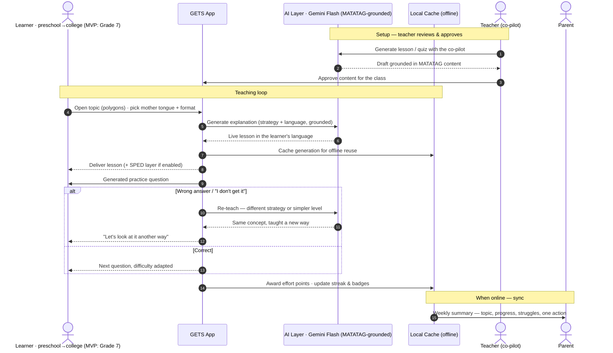

<!-- Date: 25 June 2026 -->

<div align="center">

<!-- TODO: replace with your real logo once you have one -->
<!--  -->

# GETS

**Guided Education for Tailored Success**

*Every learner gets the support they need.*

<!-- Replace these badges with your ACTUAL stack. Generate more at https://shields.io -->


**Team:** Stack-a-ton
**Hackathon:** ACM TechSprint × Accenture · `[FILL IN — date]`
**Live Demo:** `[FILL IN — demo URL / video link]`

</div>

---

## Table of Contents

1. [Overview](#overview)
2. [The Problem](#the-problem)
3. [Why GETS Is Different](#why-gets-is-different)
4. [Early Validation](#early-validation)
5. [How It Works](#how-it-works)
6. [How It's AI-Powered](#how-its-ai-powered)
7. [Can Students Trust the AI?](#can-students-trust-the-ai)
8. [Case Study: Grade 7 Mathematics Under MATATAG](#case-study-grade-7-mathematics-under-matatag)
9. [Core Features](#core-features)
10. [Tech Stack](#tech-stack)
11. [Repository Structure](#repository-structure)
12. [Screenshots](#screenshots)
13. [Getting Started](#getting-started)
14. [Environment Variables](#environment-variables)
15. [UI/UX Design Direction](#uiux-design-direction)
16. [Pilot Study Design](#pilot-study-design)
17. [MVP Scope & Roadmap](#mvp-scope--roadmap)
18. [Business Model & Adoption](#business-model--adoption)
19. [Team](#team)
20. [Acknowledgements](#acknowledgements)

---

## Overview

GETS is an AI-powered, **multilingual (mother-tongue-first)**, offline-capable learning companion for **Filipino learners across the education journey — preschool to college** — including learners with dyslexia, ADHD, and autism. It meets each learner in the way that fits them, in the language they think in, at any stage.

> **Vision vs. MVP — read this first.** GETS is designed to be **grade-agnostic**: the same engine, teaching strategies, and adaptation logic work at any level, with only the curriculum content changing per stage. For this hackathon, our **MVP proves the concept on one concrete, live cohort — Grade 7 Mathematics (polygons)** — chosen because Grade 7 is part of the first MATATAG rollout (SY 2024–2025). The breadth is the vision; the Grade 7 build is the proof it's real.

Most ed-tech asks *"how do we make this kid learn faster?"* GETS asks *"why did this kid stop trying?"* — because the answer is usually that they were **overwhelmed, not incapable**. When a learner gets something wrong, GETS doesn't say *"Wrong. Try again."* It says *"Let's look at it another way"* — and teaches the same concept in a different way until it lands.

GETS serves three people at once:

- **Learners** get a patient tutor that meets them in the format that fits them.
- **Teachers** get a co-pilot that generates lessons, practice, and progress summaries — which they review and approve.
- **Parents** get a clear, jargon-free window into what their child is learning and where they're stuck.

---

## The Problem

Many Grade 7 students enter junior high school with uneven foundations in reading, numeracy, and confidence. In a typical classroom, one teacher supports many learners at very different levels at once:

- Some students understand the lesson immediately; some need a worked example.
- Some are too shy to ask questions.
- Some need the lesson explained in Tagalog or Taglish.
- Some lose access when the internet is slow or unavailable.
- Parents often don't know exactly which topic their child is struggling with.

The context is urgent and specific:

- The Philippines ranked **near the bottom globally** in the 2018 PISA assessments for reading, maths, and science.
- A 2022 World Bank report found **over 90% of Filipino 10-year-olds** could not read a simple text.
- The **MATATAG curriculum** for Grade 7 went live in **SY 2024–2025** — it is the curriculum these students are on *right now*.
- Connectivity across much of the Philippines is patchy, so an online-only tool doesn't reach the learners who need it most.

The deeper problem is not only access to lessons. It is that **many students stop trying when they feel left behind.** GETS is designed to intervene at exactly that moment.

---

## Why GETS Is Different

This is not another offline tutor or quiz app. Four things set it apart.

### 1. One concept, many ways to learn — and it adapts when you're stuck

A single MATATAG competency can be taught five different ways, and when a lesson doesn't land, GETS re-teaches the same concept in a *different* way rather than repeating it louder. That adapt-on-failure loop is the heart of the product.

### 2. SPED accessibility as a first-class feature

Most teams won't touch accessibility. GETS builds in support for dyslexia, ADHD, and autism as switchable accommodations — *supports, not labels* — so the learners traditional classrooms most often leave behind are the ones it serves best.

### 3. Mother-tongue-first, offline-first

The Philippines has over 120 distinct languages — not dialects — and "Tagalog + English" quietly assumes every learner is fluent in Tagalog, which isn't true: for a child in Cebu, Iloilo, or the Ilocos, Tagalog is often itself a second language. GETS teaches in the learner's **mother tongue**, not just the national one, aligning with MATATAG's own mother-tongue-based multilingual education principle. The MVP proves this in **Tagalog and English** (verified quality); the architecture treats language as a parameter, so other Philippine languages plug in as we validate generation quality in each (see roadmap). All of it works offline on low-cost devices, syncing when a connection returns. *This is how GETS reaches the provincial learners that Tagalog-centric and online-only tools leave behind.*

### 4. Grade-agnostic by design

The engine, teaching strategies, and adaptation logic are built **once** and work at any level — preschool to college. Only the curriculum content changes per stage. Grade 7 is where we prove it; the same architecture extends across the whole education journey without re-engineering.

---

## Early Validation

GETS is early-stage, and we're honest about that — no signed pilot yet, no validated pricing (those are explicit next-step priorities). But the direction has been checked with the two audiences that matter most:

- **A practising private high-school teacher** reviewed the concept and said she **would use it in her own classroom** — the strongest signal we could ask for at this stage, because the teacher is the gatekeeper to real adoption.
- **A professional from Accenture** gave **positive feedback on the concept** in conversation.

> *These are early, informal signals — directional encouragement, not formal endorsements or partnerships. We're naming the roles, not the individuals, out of respect for their time and privacy. Our near-term priority is to turn this interest into a structured pilot with documented outcomes.*

---

## How It Works



The engine never punishes a wrong answer with a dead end — it routes a failed lesson back to be taught differently, in the learner's own language, and remembers which approach worked so the next lesson starts smarter. The teacher stays in the loop as reviewer; the parent gets a calm weekly window when a connection returns.

---

## How It's AI-Powered

GETS uses a **cloud language model to generate every lesson and practice set live** — it is not a library of pre-written content.

- **Explaining concepts in the learner's language:** the AI generates each explanation on demand, in the chosen language — **Tagalog and English in the MVP, other Philippine mother tongues as quality is validated** — using one of **five teaching strategies**, which are five different ways of *prompting* the model:
  1. **Read and listen** — a clear written explanation, with read-aloud
  2. **Worked example** — solve one fully, then a similar one with steps to complete
  3. **Guiding questions** — Socratic teaching, learning by being asked
  4. **Quest mode** — the concept framed as a short challenge
  5. **Super simple explanation** — plain-language ELI5, in Tagalog or Taglish
- **Generating practice:** the AI produces fresh practice questions on the fly, scaled to the topic — not a fixed question bank.
- **Adapting to level:** the AI evaluates answers, explains *why* a mistake is wrong, and regenerates the concept at a simpler level or in a different strategy.

**Offline resilience:** every AI generation is cached locally, so a learner who loses signal keeps a working lesson and practice set, and new content syncs when they reconnect. *Generation needs connectivity; the cache is what makes it survive low-bandwidth conditions.* Because the AI's output is concise text, it's light over slow connections.

---

## Can Students Trust the AI?

An AI tutor that confidently teaches something wrong is worse than no tutor. GETS earns trust by design:

- **Grounded in the curriculum, not freelancing.** Generation is anchored to the actual DepEd MATATAG competency and content, so the AI explains *verified material* rather than guessing from open-ended prompts.
- **Teacher-reviewed.** The teacher reviews and approves AI-generated lessons, quizzes, and summaries before they reach students. The AI assists; the teacher remains the authority.
- **Source-tagged.** Lessons show they're drawn from the student's real Grade 7 MATATAG syllabus, so learners and parents can see it's their actual curriculum.
- **Designed to defer.** When the AI is unsure, it points the student back to their teacher or textbook rather than inventing an answer.

GETS is a **companion, not a replacement** for the teacher.

---

## Case Study: Grade 7 Mathematics Under MATATAG

> *This is the **MVP proving ground** — one concrete stage chosen to demonstrate an approach designed for the whole education journey. The scenarios below are Grade 7, but the loop they illustrate (teach → check → re-teach differently → adapt) is the same at any level.*

A Grade 7 public-school learner is studying **polygons** — a topic that needs both language comprehension and spatial reasoning, where uneven foundations show up quickly.

### Learner scenario

The teacher explains polygons in class, but the learner doesn't fully grasp the difference between sides, vertices, angles, and types of polygons.

At home, the learner opens GETS on a mobile phone. GETS explains the concept in simple language. When the learner still doesn't understand, GETS **changes the teaching format** rather than repeating itself — the learner can switch between read-and-listen, a worked example, guiding questions, quest mode, or a super-simple explanation, in Tagalog or English.

When the learner answers a practice question incorrectly, GETS responds with **encouragement**, explains the mistake, and re-teaches the concept more simply. The learner keeps going even when the connection drops, because lessons and practice are cached offline. Accessibility supports (dyslexia-friendly font and read-aloud, shorter ADHD-friendly chunks, a calm low-clutter mode) can be switched on at any time.

### Teacher scenario

The Grade 7 Mathematics teacher uses GETS as a **co-pilot** to generate a short lesson plan on polygons, practice questions, a quiz with answer key, simpler explanations for struggling learners, enrichment for advanced learners, and a parent-friendly progress summary. **The teacher reviews and approves all AI-generated content.** GETS doesn't replace the teacher — it helps the teacher personalise support for more students at once.

### Parent scenario

The parent opens a simple dashboard and sees more than a grade: which topic the child practised, which questions they got right, which concepts were difficult, how many times they asked for re-teaching, and suggested home practice for the week.

> *Example summary:* Your child understands basic polygon names but needs more practice identifying sides, vertices, and angles. Try 10 minutes of practice this week using objects at home — windows, notebooks, and tiles.

The parent doesn't need to be a maths expert. GETS gives simple, supportive guidance.

### Why this case matters

The deeper problem isn't access to lessons — it's that students stop trying when they feel left behind. Instead of *"Wrong. Try again,"* GETS says *"Let's look at it another way."* That single shift — from speed to dignity — is what makes GETS useful to learners, teachers, and parents in real Philippine classroom conditions.

---

## Core Features

### Adaptive multi-format lessons (AI-generated)

- Five teaching strategies generated live, in Tagalog or English
- An **"explain again a different way"** action and automatic **re-teaching** when a lesson doesn't land
- Mapped to **MATATAG Grade 7 competencies** (Quarter 1: polygons, forces & motion, poetry)

### Ask the tutor anything (conversational)

- A **text chat** where the learner can ask the AI tutor questions in their own words — *"bakit po ganito?"*, "can you explain step 2 again?", "give me a harder one" — instead of only following a fixed lesson path
- The conversation stays **grounded in the MATATAG topic** and the tutor's supportive, defer-when-unsure behaviour, so it helps rather than wanders or invents
- Lets a shy learner ask the questions they'd never raise in a class of 40

### SPED accessibility modes

- **Dyslexia** — dyslexia-friendly font, read-aloud, text highlighting while reading
- **ADHD** — micro-lessons (3–5 min), focus-friendly pacing, frequent rewards
- **Autism** — predictable layout, reduced visual clutter, structured flow

### Teacher co-pilot

- Generate lesson plans, practice, quizzes with answer keys, differentiated explanations, and parent summaries — all teacher-reviewed before use

### Reward system (designed not to backfire)

- **Effort points** for showing up and trying — not just correct answers
- **Forgiving streaks** with freezes and a comeback bonus, so a missed day or no signal doesn't punish the learner
- **Mastery badges** tied to real MATATAG competencies (e.g. "Polygon Master · Q1 Math")
- **Optional class leaderboard** ranked on effort and consistency, off by default

### Emotion-aware learning

- A gentle, optional mood check-in that adjusts lesson tone — shorter, gentler, more encouraging on a hard day

### Parent dashboard

- A calm weekly summary, **not a gradebook**: what was practised, what's difficult, how often re-teaching was needed, and one concrete suggestion to help at home

### Offline-first

- Cached AI generations work with no connection; progress logs locally and syncs when online

---

## Tech Stack

> This table reflects what the app **actually runs on** in the MVP.

### Core

| Layer | Technology | Purpose |
| --- | --- | --- |
| Framework | **React 18 + Vite 5** | Mobile-first single-page web app |
| Language | **JavaScript** (JSX, ES modules) | App + server code |
| Styling | **Hand-written CSS** (`src/styles.css`) | Warm, accessible, mobile-first UI |
| Backend | **Express** (local proxy) | Holds the API key; serves `POST /api/generate` so the key never reaches the browser |

### AI / Generation

| Layer | Technology | Purpose |
| --- | --- | --- |
| LLM provider | **Google Gemini Flash** (via Google AI Studio API) — model: `gemini-2.5-flash` (override with `GEMINI_MODEL`) | Live generation of lessons & practice |
| Provider switch | Pluggable via `GETS_PROVIDER` — `gemini` (default) · `groq` · `anthropic` | Swap LLM with one env var, no code change |
| Prompting | Five teaching-strategy prompts (`shared/prompts.mjs`) | How the model is instructed to teach |
| Grounding | MATATAG curriculum content | Anchors generation to verified material |

### Data & Offline

| Layer | Technology | Purpose |
| --- | --- | --- |
| Local storage | **Browser `localStorage`** (`gets-cache-v1`) | Cached lessons & practice — offline-first |
| Offline seed | **`public/seed-cache.json`** via `npm run seed` | Pre-generates all formats × languages before a demo, so it runs with zero connection |
| Offline detection | `navigator.onLine` + cache fallback | Falls back to the saved version and shows an "offline" badge |

> **Be honest about the AI in your demo:** generation happens via a cloud model and is cached for offline use. That hybrid is *how the app works in low-bandwidth conditions*. State it plainly — it reads as competence.

---

## Repository Structure

```
gets/
├── public/
│   └── seed-cache.json         # pre-generated offline cache (npm run seed)
├── shared/
│   ├── prompts.mjs             # five teaching-strategy prompts + practice schema
│   └── generate.mjs            # LLM calls (Gemini / Groq / Claude), key from env
├── server/
│   └── index.mjs               # local proxy: POST /api/generate (holds the key)
├── scripts/
│   └── preseed.mjs             # one-time: generate the offline cache
├── src/
│   ├── App.jsx                 # lesson + practice flow, strategy/language switching
│   ├── components/
│   │   └── Practice.jsx        # AI-generated adaptive drills
│   ├── lib/
│   │   ├── api.js              # live fetch → cache fallback (offline)
│   │   └── cache.js            # local-storage cache + seed loader
│   ├── strings.js              # UI copy + subject/topic/strategy config
│   ├── styles.css              # warm, accessible, mobile-first theme
│   └── main.jsx
├── .env.example
├── vite.config.js
├── package.json
└── README.md
```

---

## Screenshots

> `[FILL IN — add real screens here once the build produces them.]`

| **Home / Welcome** | **Multi-format Lesson** | **Adaptive Practice** |
| --- | --- | --- |
| `[screenshot]` | `[screenshot]` | `[screenshot]` |

| **Rewards** | **Accessibility Settings** | **Parent Dashboard** |
| --- | --- | --- |
| `[screenshot]` | `[screenshot]` | `[screenshot]` |

---

## Getting Started

### Prerequisites

- **Node.js 18+**
- An API key for **one** provider — **Google Gemini Flash** is the default (free tier, no card; key at [aistudio.google.com/apikey](https://aistudio.google.com/apikey))

### Installation

```bash
git clone [FILL IN — repo URL]
cd gets
npm install
cp .env.example .env          # then add your API key
npm run dev                   # app on http://localhost:5173
```

### Make it work offline (before a demo, while online)

```bash
npm run seed                  # generates public/seed-cache.json for the topic
npm run build
npm run preview               # serve the build — now works offline from the seed
```

> **Keep your API key out of the repo.** `.env` is already in `.gitignore` — never commit it.

---

## Environment Variables

| Variable | Required | Description |
| --- | --- | --- |
| `GETS_PROVIDER` | No | `gemini` (default) · `groq` · `anthropic`. Auto-detects by which key is set if unset. |
| `GEMINI_API_KEY` | If using Gemini | Google AI Studio key for Gemini Flash generation |
| `GEMINI_MODEL` | No | Defaults to `gemini-2.5-flash` |
| `GROQ_API_KEY` | If using Groq | Groq key (free) — model defaults to `llama-3.3-70b-versatile` |
| `ANTHROPIC_API_KEY` | If using Claude | Anthropic key — model defaults to `claude-haiku-4-5` (needs paid credit) |
| `PORT` | No | Generation proxy port (default `8787`) |

---

## UI/UX Design Direction

- **Visual identity:** warm, friendly, calm — a supportive companion, never a strict teacher. Rounded corners, soft colours, generous spacing, large readable text, high contrast.
- **Multilingual, mother-tongue-first:** the learner's own language, not just the national one. MVP in Tagalog + English (mixing naturally as Taglish); other Philippine languages on the roadmap.
- **Accessibility-first:** clear hierarchy, dyslexia-friendly typography option, read-aloud and text-size controls, a calm reduced-clutter mode.
- **Responsive:** mobile-first, portrait, optimised for low-cost devices and low bandwidth.

---

## Pilot Study Design

A real school pilot can test GETS using one Grade 7 Mathematics topic.

**Setup:** Grade 7 · Mathematics · Polygons · 1–2 weeks · one or two sections · student/school mobile devices · online when available, offline when needed.

**Pre-test:** basic polygon identification; sides, vertices, and angles; confidence rating before using GETS.

**Intervention:** students learn polygons through the five teaching formats, complete practice, and receive re-teaching after wrong answers; teachers monitor class-level progress; parents receive a short summary.

**Post-test:** parallel polygon assessment; confidence rating; teacher and parent feedback; offline-usage check.

**Success indicators:** improvement from pre- to post-test; fewer repeated mistakes; more completed practice attempts; increased confidence; teacher-reported time saved; parent understanding of weak areas.

> *Targets are illustrative until the pilot runs — frame any figures as goals, not results.*

---

## MVP Scope & Roadmap

### In the MVP (built for the hackathon)

- **One stage, proven deeply: Grade 7** — a live MATATAG cohort
- **3 subjects** — Mathematics, Science, English (the highest-weighted MATATAG areas)
- **1 competency shown end-to-end** (polygons) through all five AI-generated formats, with SPED modes live
- **AI generation + offline cache**, forgiving streak, effort points, competency badges
- **Parent dashboard** and **teacher co-pilot**

### Roadmap (deliberately out of MVP)

GETS is designed for the **whole education journey — preschool to college**. The MVP proves it on Grade 7; expansion is content authoring on a fixed engine, not re-engineering:

- **Grade by grade across the journey** — outward to other junior high grades, up to senior high and college, and down to early years. This *rides the MATATAG phased rollout*, which is itself being implemented grade by grade through to 2027–2028.
- **Mother-tongue expansion** — beyond Tagalog and English to the most-spoken Philippine languages, in order of reach (by 2020 Census home-language data): **Cebuano/Bisaya** (~16% of households), **Hiligaynon/Ilonggo** (~7%), **Ilocano** (~7%), then **Bikol** and **Waray**. Each is added only once we've **validated generation quality** in it — we won't ship a language the model handles poorly, because broken-language teaching fails the learner. Language is a parameter in the architecture, so this is validation-and-authoring, not re-engineering.
- **More subjects and full quarter coverage** per stage
- A **light teacher layer** so schools can deploy GETS to classes (without becoming a heavy LMS)
- **On-device generation** for true offline AI as devices and models allow
- **Additional SPED accommodations**

The architecture is **grade- and subject-agnostic** — the engine, prompts, rewards, and accessibility layers are built once, and every new stage or subject plugs in as content.

---

## Business Model & Adoption

GETS will **never charge the struggling students who are its reason for existing.** Someone other than the learner pays — and *which* payer comes first is a deliberate, sequenced choice, not "everyone at once."

### The phased wedge (who pays, in what order)

We serve all Filipino learners — but we win one beachhead first, prove outcomes, then expand. Going after every payer at once is how young ed-tech ventures stall.

- **Phase 1 — beachhead: CSR/grant-funded pilots + private schools & NGO learning centres.** These move fast, have technology budgets or grant backing, and feel the personalised-and-SPED-support gap most acutely. Crucially, a **CSR- or grant-funded pilot lets us serve public-school learners — our actual mission — while a foundation or corporate partner pays**, resolving the who-pays tension directly. *(Programmes like this one are a natural on-ramp.)*
- **Phase 2 — scale: DepEd / LGU.** The biggest impact and the truest mission fit, but multi-year procurement and unfunded at student scale. This is the **long game we earn with Phase 1 pilot evidence** — not a Year 1 revenue line.
- **Cross-subsidy throughout:** paying private schools and partners underwrite free public-school access. The people who can pay fund the people who can't.

### Unit economics (the structural advantage)

GETS's cost to serve is **low and mostly variable API cost**, not expensive per-client engineering:

- Lessons and practice are **generated by Gemini Flash** (a low-cost model) and **cached and reused**, so the marginal cost of an additional student is **cents in API calls**, not a custom build.
- The **engine, prompts, accessibility, and rewards are built once** and reused across every learner, school, and grade — content is the only per-stage cost, and it's authoring, not re-engineering.
- This is a genuinely different cost structure from approaches that train a bespoke model per client.

### Pricing model (illustrative — to be validated)

We use a **flat per-school annual licence** — the model the ed-tech industry recommends for schools because it gives them *budget predictability* and decouples cost from fluctuating enrolment. Public schools are free (funded via grants/CSR and cross-subsidy); the licence applies to paying private schools and institutions.

The figures below are an **illustrative hypothesis, not validated pricing** — they're reasoned against the real market, and testing them is a Month 1–3 priority:

| School size | Indicative annual licence | Reasoning |
| --- | --- | --- |
| Small private school | `₱[lower band]` | A small fraction of per-student tuition |
| Medium | `₱[mid band]` | Scales with student population served |
| Large / progressive | `₱[upper band]` | Larger reach, more subjects/grades live |

**Why these are plausible (the anchors):**

- Philippine **private high-school tuition averages ~₱150,000/student/year**, and tech-forward schools charge ₱200,000–₱800,000; more affordable private schools sit around ₱30,000–₱44,000/student. A *whole-school* supplementary tool only needs to cost a **small fraction of one student's tuition** to be an easy yes.
- The K–12 online-learning market in the Philippines is large (≈USD 1.8B), and government has earmarked ≈₱1.5B for digital education — so budgets for tools like this exist on both the private and public sides.
- Our **cost to serve is cents per student**, so even modest licence fees carry healthy margin — pricing pressure is a strategic choice, not a survival constraint.

> **We have not yet validated these numbers with real schools** — no signed pilot, no confirmed price. We're showing the *model and the reasoning* rather than a falsely precise figure. The first paying pilot, with documented cost-to-serve and a tested licence price, is our explicit near-term goal. *(This is the discipline the market itself recommends: 60%+ of ed-tech startups cite pricing as their hardest problem, and the answer is systematic testing, not a guessed number.)*

### Why this is defensible (the moat)

The AI itself is a commodity — anyone can call a model, and on-device small models are improving fast. GETS's durable advantage is **everything built around the model**, none of which a general chatbot replicates:

- **MATATAG-grounding** — aligned to the actual DepEd curriculum, so it teaches the right thing and doesn't hallucinate generic content
- **Pedagogical design** — five teaching strategies and the adapt-on-failure loop, not just answers
- **SPED depth** — accessibility most tools won't touch
- **Three-user fit** — learner, teacher, and parent, matching how Philippine education actually works
- **Filipino-first localisation** — Tagalog/Taglish, offline-capable, built for low-cost devices

### Adoption path

GETS is **MATATAG-native** (the precondition for any DepEd alignment) and **offline-capable** (reaching rural and remote schools online-only tools can't). The realistic route is **funded pilot → evidence of learning outcomes → expansion** — proven on a private/NGO/CSR beachhead, then scaled toward public-school and DepEd reach. Not instant national rollout; a sequence with a clear first step.

---

## Team

<div align="center">

**Stack-a-ton**

<table>
  <tr>
    <td align="center" width="25%">
      <br/>
      <strong>Ellah Benerado</strong><br/>
      <br/>
      <a href="https://www.linkedin.com/in/ellahvate"></a>
    </td>
    <td align="center" width="25%">
      <br/>
      <strong>Eliesha Mae Francisco</strong><br/>
      <br/>
      <a href="https://www.linkedin.com/in/elifrncsc"></a>
    </td>
    <td align="center" width="25%">
      <br/>
      <strong>Lance Evangelista</strong><br/>
      <br/>
      <a href="https://www.linkedin.com/in/lance-miguel-evangelista-58691a315"></a>
    </td>
    <td align="center" width="25%">
      <br/>
      <strong>Osyris Fajardo</strong><br/>
      <br/>
      <a href="https://www.linkedin.com/in/osyris-benedict-fajardo-237b1738b"></a>
    </td>
  </tr>
</table>

</div>

---

## Acknowledgements

> *Lists what the prototype actually ships — an acknowledgement implies use. Some carry attribution requirements (see notes), so this section is kept accurate.*

**Currently used in the MVP:**

- **Live generation** powered by **Google Gemini Flash** (`gemini-2.5-flash`) via the Google AI Studio / Gemini API.
- **Curriculum alignment and lesson grounding** based on the DepEd **MATATAG Curriculum Guides** (Grade 7, SY 2024–2025), Department of Education, Philippines — used under DepEd's open-access terms (Executive Order No. 2, s. 2016; share-and-adapt with attribution).
- **Read-aloud** powered by the browser's built-in **Web Speech API** (`speechSynthesis`).
- Built with **React**, **Vite**, **Express**, and **Node.js**.
- Provider layer is pluggable: **Groq** (Llama 3.3 70B) and the **Anthropic SDK** (Claude) are supported as alternate LLM backends via one env var.

**Planned (acknowledged when the feature ships):**

- **OpenDyslexic** typeface by Abbie Gonzalez ([opendyslexic.org](https://opendyslexic.org)), under the **SIL Open Font License 1.1**, for the dyslexia accessibility mode on the roadmap. *(Attribution will be required once bundled.)*

---

<div align="center">

*Built with care for the learners traditional classrooms leave behind.*

</div>
